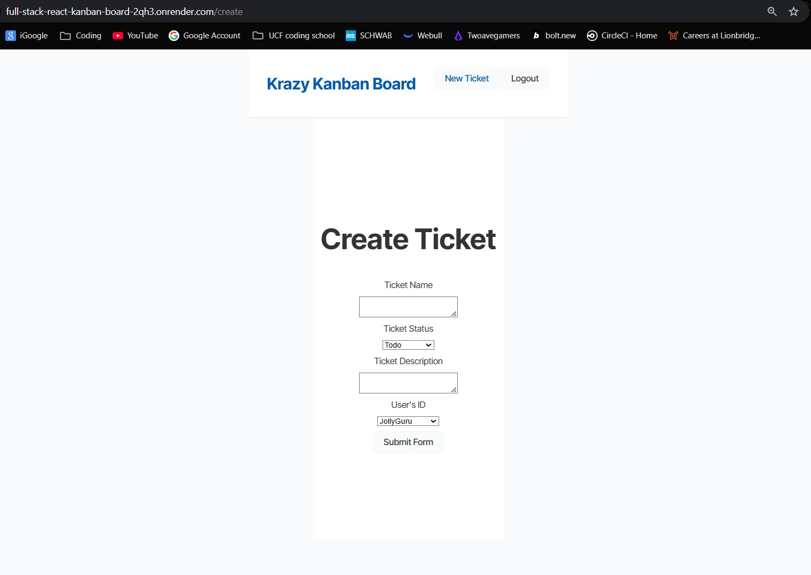

# Kanban Board Challenge

## 📋 Overview

This Kanban Board Challenge is a full‑stack web application designed to help teams visualize and manage tasks through a classic Kanban-style interface. It features a React front end, an Express.js backend with JWT-based authentication, and a PostgreSQL database accessed via Sequelize ORM.

## ⚙️ Features

* **User Authentication**: Secure sign-up and login using JSON Web Tokens (JWT).
* **Kanban Board**: Create, edit, and delete tasks organized in columns (e.g., To Do, In Progress, Done).
* **Drag & Drop**: Seamlessly move tasks between columns with intuitive drag-and-drop interactions.
* **RESTful API**: CRUD operations for users and tickets, following REST conventions.
* **Database Seeding**: Pre-populate development database with sample users and tickets.
* **CORS Enabled**: Safe cross-origin requests between front end and back end.


## Screenshots





## 🛠️ Technologies

| Layer          | Technology                      |
| -------------- | ------------------------------- |
| Front End      | React, Vite                     |
| Back End       | Node.js, Express                |
| Authentication | JSON Web Tokens                 |
| Database       | PostgreSQL, Sequelize ORM       |
| Dev Tools      | TypeScript, ESLint, ts-node-dev |

## 📥 Prerequisites

* **Node.js** (v16+)
* **npm** (v8+)
* **PostgreSQL** (v12+)
* **Git** (for cloning the repository)

## 🚀 Installation

1. **Clone the repository**

   ```bash
   this is the SSH Key
   git clone git@github.com:LPerez21/Full-Stack-React-Kanban-Board.git
   cd kanban-board
   ```

2. **Server setup**

   ```bash
   cd server
   npm install
   npm start
   ```

3. **Client setup**

   ```bash
   cd ../client
   npm install
   npm start
   ```

## 🔧 Configuration

1. **Environment Variables**

   * Duplicate `.env.example` files in both `/server` and `/client` as `.env`.
   * Configure the following in `/server/.env`:

     ```dotenv
     DATABASE_URL=postgres://<user>:<password>@localhost:5432/<database>
     JWT_SECRET=your_jwt_secret
     PORT=3001
     ```

## 🗄️ Database Seeding (Server)

To populate your development database with sample data:

```bash
cd server
npm run build       # Compile TypeScript to JavaScript
npm run seed-only   # Run seeding script
```

## ▶️ Running the Application

### Development Mode

1. **Back End**

   ```bash
   cd server
   npm run dev       # Start Express with hot-reload
   ```

2. **Front End**

   ```bash
   cd client
   npm run dev       # Start Vite dev server (http://localhost:3000)
   ```

### Production Preview

1. **Build & Serve Server**

   ```bash
   cd server
   npm start         # Build, seed, and launch on port 3001
   ```

2. **Build & Preview Client**

   ```bash
   cd client
   npm start         # Build and preview production bundle
   ```

## 📦 API Endpoints

### Users

| Method | Endpoint              | Description                  |
| ------ | --------------------- | ---------------------------- |
| POST   | `/api/users/register` | Register a new user          |
| POST   | `/api/users/login`    | Authenticate and receive JWT |
| GET    | `/api/users`          | List all users (protected)   |

### Tickets

| Method | Endpoint           | Description               |
| ------ | ------------------ | ------------------------- |
| GET    | `/api/tickets`     | Retrieve all tickets      |
| POST   | `/api/tickets`     | Create a new ticket       |
| GET    | `/api/tickets/:id` | Retrieve a single ticket  |
| PUT    | `/api/tickets/:id` | Update an existing ticket |
| DELETE | `/api/tickets/:id` | Delete a ticket           |

> **Note:** All `/api` routes require a valid `Authorization: Bearer <token>` header, except registration and login.

## 📜 Scripts

| Script              | Location | Description                                 |
| ------------------- | -------- | ------------------------------------------- |
| `npm run dev`       | server   | Run Express with hot-reload via ts-node-dev |
| `npm run build`     | server   | Compile TypeScript into `dist/`             |
| `npm start`         | server   | Build, seed, and start server               |
| `npm run seed-only` | server   | Run database seeder                         |
| `npm run dev`       | client   | Start Vite dev server                       |
| `npm run build`     | client   | Type-check and build production bundle      |
| `npm start`         | client   | Build and preview production bundle         |

## 🗂️ Project Structure

```
kanban-board/
├─ client/          # React front end (Vite + TSX)
├─ server/          # Express back end (TS)
│  ├─ src/
│  │  ├─ controllers/
│  │  ├─ middleware/
│  │  ├─ models/
│  │  ├─ routes/
│  │  ├─ seeds/
│  │  └─ index.ts
│  ├─ dist/         # Compiled JavaScript output
│  ├─ .env.example
│  └─ tsconfig.json
└─ README.md
```

## 🤝 Contributing

Contributions are welcome! Please:

1. Fork the repository
2. Create a feature branch (`git checkout -b feature/YourFeature`)
3. Commit your changes (`git commit -m "Add YourFeature"`)
4. Push to your branch (`git push origin feature/YourFeature`)
5. Open a Pull Request

## 📄 License

This project is licensed under the [MIT License](LICENSE).

## 📞 Contact

Luis Pérez – [luisperez.lp@gmail.com](mailto:luisperez.lp@gmail.com)

Project Link: [https://github.com/LPerez21/Full-Stack-React-Kanban-Board#](https://github.com/LPerez21/Full-Stack-React-Kanban-Board#)
